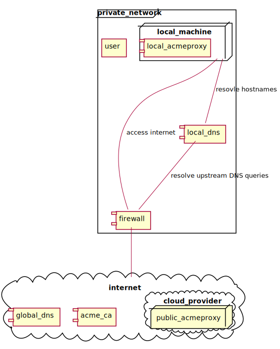

# `acmeproxy`

`acmeproxy` is a proxy for [ACME
compliant](https://tools.ietf.org/html/rfc8555) certificate authorities.

[](https://godoc.org/github.com/fhofherr/acmeproxy)
[](https://goreportcard.com/report/github.com/fhofherr/acmeproxy)
[](https://golangci.com/r/github.com/fhofherr/acmeproxy)
[](https://circleci.com/gh/fhofherr/acmeproxy)
[](https://coveralls.io/github/fhofherr/acmeproxy)

## Purpose

`acmeproxy` is meant for situations similar to the one shown in the following
overview diagram:



A private network is separated from the Internet by a firewall. All
traffic to and from the Internet must go through that firewall. While
local machines are able to access the Internet they are not accessible
from the Internet.

Those local machines provide services to users within the private
network. Each local machine has a private network IP address. A local
DNS server maps those IP addresses to valid DNS host names. Connection
to those services has to be TLS encrypted. This requires valid SSL/TLS
certificates.

One way to provide such certificates is using self-signed certificates.
Another would be to create a private certificate authority, which then
issues those certificates. An [excellent
article](https://jamielinux.com/docs/openssl-certificate-authority/index.html)
on how to do this can be found on Jamie Nguyen's website.

Unfortunately both approaches have a serious drawback. Most browsers and
other TLS clients rightfully treat self-signed certificates as
a security risk. Even when using ones own certificate authority, it is
necessary to import the root certificate used to sign the services'
certificates into all browsers or other clients used to access those
services. This quickly becomes tedious and annoying.

The ACME Protocol, and especially [Let's
Encrypt](https://letsencrypt.org/), provide an alternative to creating
ones own certificate authority. Additionally Let's Encrypts root
certificate is included in most browsers and clients. Therefore the
annoying import of root certificates is not necessary anymore.

However, there is no free lunch. It comes as no surprise that also Let's
Encrypt has a drawback. Before Lets Encrypt is able to issue
a certificate for the requested domain name it relies on a proof of
ownership of the domain name.

The most straightforward way of proofing ownership is the
[HTTP-01](https://letsencrypt.org/docs/challenge-types/) challenge. This
challenge relies on a token being served over HTTP from the domain
requesting the certificate. If for example `host.example.com` wants
a certificate from Let's Encrypt, it has to provide a token which it
obtained from Let's Encrypt under
`http://host.example.com/.well-known/acme-challenge/<TOKEN>`. Naturally
this token is random and changes for each certificate renewal.

Since the hosts in the private network are not accessible from the
Internet Let's Encrypt will not be able to access the above URL and this
will not be able to validate our ownership. Thus, it will not issue
a certificate for those hosts.

There exists another challenge type for such circumstances, which is
called [DNS-01](https://letsencrypt.org/docs/challenge-types/). It
relies on the token being available as a `TXT` record on the DNS server
managing the DNS entries for the requesting domain. Unfortunately this
requires some kind of API to create such an `TXT` record. Not all DNS
providers provide such an API.

This is where `acmeproxy` comes into play. It allows hosts otherwise
unaccessible from the Internet to offload the HTTP-01 challenge. It
relies on the fact that all local machines have a valid DNS name. While
the local DNS server maps those names to a private network IP address,
a public DNS server may map those DNS names to the IP address of
a server accessible to Let's Encrypt or a similar certificate authority.
Naturally this server then runs `acmeproxy`.

`acmeproxy` supports three operation modes which allow its clients to
retrieve valid SSL/TLS certificates from Let's Encrypt.

* `acme-client`: `acmeproxy` acts like any other ACME protocol client.
  It performs an HTTP-01 challenge, retrieves the certificates, and
  stores them locally. Additionally it makes sure that certificates get
  renewed before they expire. By executing
  a `certificate-obtained-hook` `acmeproxy` is able to inform clients
  on the same system about a new certificate.

* `certificate-agent`: `acmeproxy` performs the HTTP-01 challenge to
  retrieve or renew certificates for its client. It encrypts the
  certificates using the client's public key and stores them locally.
  The client may retrieve the certificates whenever it is able to do so.

* `acme-gateway`: `acmeproxy` acts as a gateway for its client. The
  client instructs `acmeproxy` to perform an HTTP-01 challenge flow to
  either retrieve or renew a certificate. `acmeproxy` then immediately
  forwards the certificate to the client without storing it, or keeping
  any meta data about the certificate.

Furthermore `acmeproxy` can act as its own client. In this mode an
`acmeproxy` instance within the local network connects to a remote
`acmeproxy` to retrieve the certificates obtained using the
`certificate-agent` or `acme-gateway` operation modes.

Regardless of the operation mode `acmeproxy` makes sure that only
authenticated and authorized clients are able to use `acmeproxy` to
retrieve certificates form Let's Encrypt or similar certificate
authorities. All communication between `acmeproxy` and its clients is
encrypted.

## Usage

`acmeproxy` can act as a server as well as a client. The following
section details how to use `acmeproxy` in both ways.

### Server

In order to start `acmeproxy` as a server execute

    acmeproxy server

By default `acmeproxy` should work as intended out of the box. If you
want to override certain settings environment variables as well as
command line arguments can be used. The command

    acmeproxy help server

gives a detailed explanation of the various command line arguments.

#### HTTPS errors

If you use `acmeproxy` to connect to a certificate authority
using untrusted certificates you will receive certificate errors. In
order to connect to such a certificate authority you have to set the
`LEGO_CA_CERTIFICATES` variable to the certificate used. This instructs
[lego](https://godoc.org/github.com/go-acme/lego) to trust this
certificate.

For example, if you want `acmeproxy` to connect to a local installation
of pebble, you have to execute:

```sh
export LEGO_CA_CERTIFICATES=$PWD/.pebble/test/certs/pebble.minica.pem
```

In this example the `.pebble` directory in the current working directory
contains a local checkout of [Pebble](https://github.com/letsencrypt/pebble).

### Client

TODO explain client operation once it is implemented.

## Development

TODO: describe steps necessary to get a development environment going

### Testing

Some of `acmeproxy`'s tests require a running instance of
[pebble](https://github.com/letsencrypt/pebble) and will be skipped if
such an instance is not configured.

The easiest way to start such an instance is to use the
local development environment:

```sh
make dev-env-up
```

This prints a bunch of environment variables which have to be set in
order to configure the tests to use the started pebble instance.

To shut down the test environment issue:

```sh
make dev-env-down
```

### Linter

`acmeproxy` uses GolangCI. The full report can be found
[here](https://golangci.com/r/github.com/fhofherr/acmeproxy)

## License

Copyright © 2019 Ferdinand Hofherr

Distributed under the MIT License.
